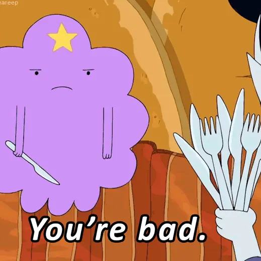

# Movie Recommendation
## 사용자의 영화 시청 이력 데이터를 바탕으로 사용자가 다음에 시청할 영화 및 좋아할 영화를 예측하는 태스크


<br/>

## Team

| icon |  |  |  |  |  |  |
| :--: | :----------------------------------------------------------: | :----------------------------------------------------------: | :----------------------------------------------------------: | :----------------------------------------------------------: | :----------------------------------------------------------: | :----------------------------------------------------------: |
| 이름 |                            한선우                            |                            신승훈                            |                            이경민                            |                            김민준                            |                            박광진                            |                            김영찬                            |
| 담당 |                          Model                            |                          Model                            |                          Model                            |                          Model                            |                          Model                            |                          Model                            |
| 역할 |             Negative Sampling, GNN, SASRec               |         NCF, DeepFM                |             FM, EASE, MF                |             Negative Sampling, Recbole             |                   RBM with LSTM, NARM, RecVAE, SLIM, MultiVAE, Ensemble                    |          SASRec, S^3 Rec, BERTRec, NCF, Ensemble                    |


<br/>

## 폴더구조

(./img/dir_img.png.png)


<br/>

## 프로젝트

### 목적

이 프로젝트는 사용자의 시청 기록과 영화에 대한 추가 메타데이터를 활용하여 사용자가 각 영화를 어떻게 평가할지 예측함으로써 사용자에게 영화를 추천하는 것을 목표로 합니다. 추천 시스템은 명시적 평점 대신 시청 순서와 같은 암시적 피드백을 기반으로 학습됩니다.

<br/>

### 데이터

- **train_ratings.csv**:  31,360명의 사용자(user)가 6,807개의 영화(item)에 대해 남긴 5,154,471건의 평점을 남긴 시간(time) 데이터 입니다.
- **Ml_item2attributes.json**: item과 genre의 mapping 데이터입니다.
- **titles.tsv**: 6,807개의 영화(item)에 대한 제목(title)정보를 담고 있는 메타데이터입니다.
- **years.tsv**: 6,799개의 영화(item)에 대한 개봉연도(year) 정보를 담고 있는 메타데이터입니다.
- **directors.tsv**: 5,905개의 영화(item)에 대한 감독(director) 정보를 담고 있는 메타데이터입니다.
- **genres.tsv**: 15,934개의 영화(item)에 대한 장르(genre) 정보를 담고 있는 메타데이터입니다.
- **writers.tsv**: 11,307개의 영화(item)에 대한 작가(writer) 정보를 담고 있는 메타데이터입니다.
<br/>

### 평가지표

**Recall@K**

- **Recall@K**는 는 사용자가 선호할 수 있는 아이템들 중에서 상위 K개에 실제로 포함된 아이템의 비율을 측정하는 지표입니다. 이 지표는 모델의 추천 성능을 평가하는 데 사용됩니다.

- **Recall@K**는 다음과 같이 정의됩니다:

  $$
  Recall@K= \frac{1}{|U|} \sum_{u \in U} \frac{| \{ i \in I_u \ | \ \text{rank}_u(i) \leq K \} |}{\min(K, |I_u|)}
  $$
  
  $$
  |U| : 총 사용자 수, \\ \\  I_u : 사용자가 상호작용한 아이템의 수, \\ \\ {rank}_u(i) : 사용자의 아이템에 대한 순위, \\ \\ K : 평가하려는 추천 목록의 상위 K개의 아이템, \\ \\
  $$


<br/>

### 협업 방법

- 구글 공유 폴더: 회의록 작성 및 자료 공유
- Github: 코드 및 프로젝트 관리
- 기타 협업 툴 사용 (Zoom, Notion, Slack)


<br/>

### Feature Engineering

| 데이터 구분     | 의미                                                         | Features                            |
| --------------- | ------------------------------------------------------------ | ----------------------------------- |
| 유저        | 유저의 연령대                            | age_range          |
|                 | 유저의 나라                       | location_country |
|  | 유저의 사는 주           | location_state                     |
|                 | 유저의 사는도시                            | location_city            |
| 책               | 책의 언어 | language                       |


<br/>

### Install

python version: 3.9x

```
pip install -r requirements.txt
```


<br/>

### 코드 및 설명

- Fm & FFm
  - FM.py/FFM.py: FM/FFM 모델을 위한 데이터 전처리와 train dataset으로 validation하는 코드입니다.
  - FM_tuning.py/FFM_tuning.py: FM/FFM 모델의 하이퍼파라미터 튜닝을 하여 로그를 저장하는 코드입니다.
  - FM_test.py/FFM_test.py: 튜닝을 통해 얻어낸 최적의 파라미터로 FM/FFM 모델을 학습시켜 test data의 평점을 예측하는 코드입니다.
- DeepFm
  - deepfm_train.py: DeepFm을 트레인하고 튜닝하는 파일입니다.
  - deepfm_data.py: DeepFm 학습을 위한 데이터 가공 함수 및 데이터 불러오기 파일입니다.
  - deepfm.py: DeepFm 모델 아키텍쳐를 클래스로 담고있는 파일입니다.
- Wide & Deep
  - wnd.py : wide&deep을 수행하는 모델 코드입니다.
  - wnd_data.py : wide&deep을 수행하기 위한 데이터 전처리 코드입니다.
  - wnd_train.py : wide&deep 모델로 학습을 실행하는 코드입니다.
- DCN
  - DCN_train.py: DCN 모델을 학습하고 평가하며 최종적으로 예측 결과를 제출 파일로 저장하는 코드 (DCN model을 실행시키는 코드).
  - DCN_dataset.py: 데이터를 전처리하여 DCN 모델 학습에 적합한 형식으로 변환.
  - DCN.py: Deep Cross Network 모델 구조를 정의하고 구현된 코드.
- NGCF
  - ngcf_models.py: NGCF 모델 코드입니다.
  - ngcf_dataset.py: NGCF 모델 학습을 위한 데이터셋 코드 입니다.
  - ngcf_train.py: ngcf 모델을 학습 및 테스트하는 코드입니다.

- NCF: ncf_train.py을 통해 ncf model을 train 하는 파일입니다.
  - ncf_dataset.py : data 로드 후 정수형 인덱스 변환 코드입니다
  - ncf_model.py : ncf, neumf 모델을 정의한 코드입니다.
  - ncf_train.py : 모델 train 하는 코드입니다.


<br/>

### 최종 제출 결과

| Model      | 리더보드 Recall@10 (중간) | 리더보드 Recall@10 (최종)|
| ---------- | -------------- | ------------ |
| ease_slim_multivae_ensemble_optuna   | 0.1600          | 0.1601        |
| ease(lambda : 350)   | 0.1600           | 0.1596        |


<br/>
